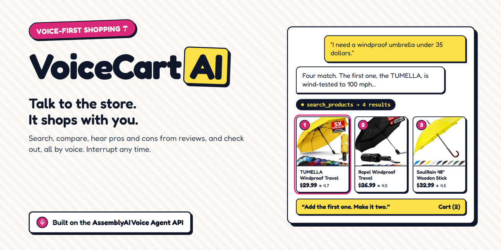
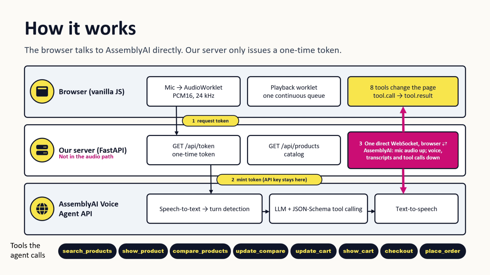
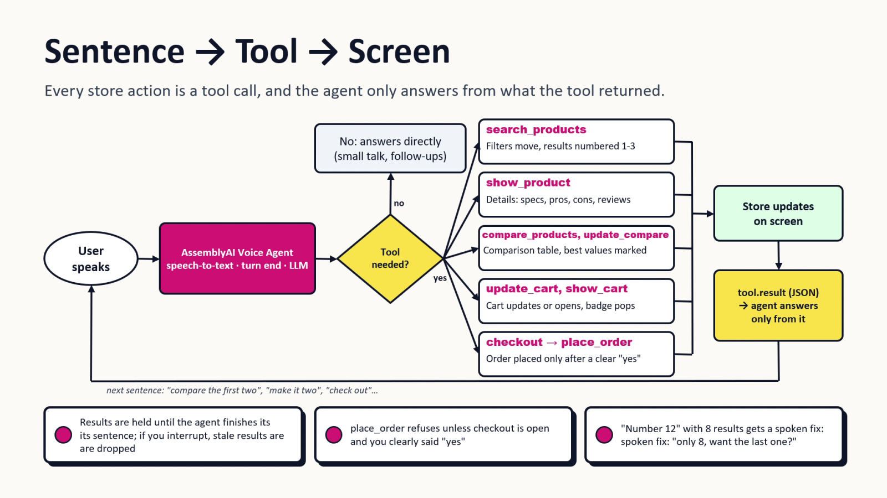

# VoiceCart AI



**Talk to the store and it answers out loud while the page changes as you speak: search, compare, ask about reviews, fill the cart and check out without touching a button.**

**Try it live:** https://voicecart-ai-o76d.onrender.com/ (Chrome or Edge, allow the microphone; headphones give the cleanest barge-in)

**Watch the 3-minute video:** https://youtu.be/I15PKSQqyfQ

Demo store: product photos are from public listings; prices, ratings and reviews are sample data.

## Why it matters

- **Stores have search boxes, not salespeople.** A question you would ask a shop assistant in one sentence becomes a dozen taps. About 70% of online carts are abandoned ([Baymard Institute](https://baymard.com/lists/cart-abandonment-rate), average of 50 studies).
- **Screens shut people out.** At least 2.2 billion people have a vision impairment ([WHO](https://www.who.int/news-room/fact-sheets/detail/blindness-and-visual-impairment)). With VoiceCart, shopping works without touching the screen.
- **It fits different catalogs.** Store owners can onboard a JSON product catalog once, then use the same storefront, eight shopping tools, and category-neutral voice prompt.

## Try saying

Press the mic, then say these in order:

1. "I need a windproof umbrella under 30 dollars." The filters move, the grid updates and the top three results get numbers.
2. "Wait, which one is the lightest?" Say it while the agent is talking: it stops mid-sentence.
3. "Compare the first two." A side-by-side table opens.
4. "What do people complain about with the first one?" The agent answers only from the store's review data.
5. "Add it to my cart. Actually, make it two." The cart updates.
6. "Check out." The agent reads the total and asks you to confirm. Then say "Yes, place it."
7. Stop the mic, start it again and ask "What's in my cart?" It remembers the visit.

## AssemblyAI features used

| Feature | What it does in VoiceCart |
|---|---|
| Voice Agent API (one WebSocket) | Speech-to-text, the LLM, and text-to-speech in one session between the browser and AssemblyAI |
| Temporary tokens (`GET /v1/token`) | Our server mints a single-use token per session, so the API key never reaches the browser |
| Client-side tool calling | 8 JSON-Schema tools (`search_products`, `show_product`, `compare_products`, `update_compare`, `update_cart`, `show_cart`, `checkout`, `place_order`) run in the browser and change the page. The agent only states prices, specs and reviews a tool returned |
| `input.keyterms` | Every brand name, so recognition spells "TUMELLA" or "SIEPASA" the way the catalog does |
| `input.turn_detection` | `min_silence 1000`, `max_silence 2000`, tuned by measurement (section 6 below) |
| Barge-in (`interrupt_response`, `input.speech.started`, `reply.done` interrupted) | The user can cut in at any time and the agent stops at once |
| `greeting` and `conversation.message` | A returning session gets "Welcome back" plus the earlier conversation, the results on screen and the cart |
| The agent's own voice | The acknowledgement clips ("Sure, let me look.") are recorded from the Voice Agent API, so they match the live voice |

## How it works





Details: [docs/ARCHITECTURE.md](docs/ARCHITECTURE.md).

## Add umbrella listings

Click the yellow **plus icon** in the top-right header to open the admin panel. Enter the admin password, product details, image URL, and specifications, then select **Add to catalog**. The product appears in the storefront immediately and is saved as a new immutable version under `data/catalogs/umbrella/`; `active.json` selects that version. New listings start with zero reviews. This is a manual UI feature; the voice agent has no admin tool.

Set `ADMIN_PASSWORD` in `.env` for local use and as a secret environment variable on the hosted service. If it is unset, the API refuses catalog writes. The admin password is sent only with the save request and is cleared from the form when the panel closes.

The app writes versioned JSON files on the server. On Render's free plan, filesystem changes are ephemeral and disappear when the service restarts or redeploys. Use a persistent disk or other durable catalog storage for lasting hosted listings; the checked-in source `data/products.json` is not changed by hosted requests.

## Use another product category

The store serves one active catalog per deployment, and the umbrella catalog is the default and the only one this repository deploys. The catalog code is category-general: catalog data, filters, details, comparison, tool definitions and results, and the voice greeting come from the active catalog's manifest, while the system prompt and the AssemblyAI audio/WebSocket flow are shared. A 3-product dry-fruit catalog in `tests/fixtures/` is test data that proves a non-umbrella catalog validates and runs through the eight tools, comparison and cart.

To prepare a new category, supply a JSON array of product objects or an object with a `products` array. Every record needs an ID, name, description, positive price, and HTTP(S) image URL (or a local `/img/` path). Source field names may differ. Onboarding maps source paths into normalized products and a validated manifest. It rejects missing required data, invalid paths, unknown field types/operators, incompatible units, and duplicate IDs. It does not generate application code or invent values.

```bash
# 1. Propose: the AssemblyAI LLM Gateway drafts a manifest (uses ASSEMBLYAI_API_KEY from .env)
python -m backend.services.catalog_onboarding path/to/items.json --category my_category
# 2. Review docs/onboarding/my_category-review.md, then 3. approve and publish
python -m backend.services.catalog_onboarding --approve <proposal-id>

# Fully manual option: publish a hand-written manifest without an LLM call
python -m backend.services.catalog_onboarding data/products.json --category umbrella --manifest-template data/umbrella_manifest.template.json
```

Proposing writes `data/proposals/<proposal-id>/` and a review report, and never changes the live catalog. `--approve` refuses a proposal that failed validation or was edited after it was proposed. Publishing writes `data/catalogs/<category>/<version>/manifest.json` and `products.json`, then moves that category's `active.json` pointer. Repeating unchanged input gives the same version; older versions stay readable for active browser sessions. Use `--no-activate` to publish without switching the live catalog. `CATALOG_ROOT` can point to another bundle directory for an isolated deployment.

The manifest declares field paths, typed attributes, units and conversion factors, search fields, filters, comparison order, display labels, variants, and example questions. Comparison directions are `higher`, `lower`, or `none`, with a rationale and confidence. Below `COMPARISON_CONFIDENCE_CUTOFF` (default `0.30`), the row remains visible but no winner is highlighted. This threshold is a policy setting, not a calibrated probability. The same backend comparison matrix is rendered on screen and returned to the voice tool.

The catalog editor uses the active category's attributes for new listings. It remains a password-protected manual UI, outside the voice agent. Checkout and order confirmation are simulations: the app does not take payment, reserve stock, or send orders to a fulfillment system.

## Run locally

Requires Python 3.10+ and an AssemblyAI API key.

```bash
python -m venv venv
venv\Scripts\activate            # Windows; on macOS or Linux: source venv/bin/activate
pip install -e ".[dev]"
cp .env.example .env             # then set ASSEMBLYAI_API_KEY
uvicorn backend.main:app --port 8000
```

Open http://localhost:8000. Localhost counts as a secure context, so the microphone works without HTTPS.

## Tests

```bash
node scripts/test_agent_tools.js   # all eight tools against the umbrella catalog and the dry-fruit test fixture
node scripts/test_mentions.js      # product mentions in the agent's speech that time the card highlights
python -m pytest -q tests/test_catalog.py  # schema, onboarding, versioning, admin API, prompt invariance
ruff check backend tests            # lint
python -m scripts.voice_latency latency --trials 4 --silence 1000:2000   # live latency, needs the API key
```

## How the voice pipeline handles interruptions and playback

The browser talks to AssemblyAI's Voice Agent API directly over a WebSocket. For the voice connection, our server mints a single-use token, so the API key never reaches the browser. Mic audio goes up as 24 kHz PCM16, and the agent's reply comes back as 24 kHz PCM16 chunks that we schedule with the Web Audio API. Getting this to feel like a real conversation took the work below.

### 1. Smooth playback: a continuous playback worklet
Reply audio arrives as ~10 ms chunks, in bursts, and at times slower than real time (we measured 0.8×). Our first version scheduled one Web Audio source node per chunk, about 100 a second. Every late chunk left the schedule empty for a moment, so one slow stretch turned into many micro-gaps, which is stutter.

Playback now runs in an `AudioWorklet` (`frontend/js/playback_worklet.js`) with one continuous queue at 24 kHz:

- Each reply starts once **300 ms** is buffered. While audio keeps up, chunks play back to back with no extra delay.
- **Rebuffer on underrun.** If a reply is about to run dry mid-reply, playback fades out over about 5 ms, waits until **500 ms** is buffered, and fades back in. Each underrun adds 200 ms to the start and rebuffer waits, up to 1 s, for the rest of the session.
- Each reply and each acknowledgement clip is a separate segment, so a short clip or the last part of a reply plays at once.

A single queue removes the per-node scheduling gaps, but it can't make a slow source fast. We tried playing each chunk the instant it arrived after an underrun. On a slow reply the queue then alternates between one chunk and silence, which is stutter.

To compare playback versions, `python -m scripts.voice_latency capture` saves real replies with their chunk arrival times. `node scripts/replay_playback.js` then plays them through any version of the worklet offline. It prints the gaps and writes WAVs to listen to. Results on 12 captured replies (2.8–6.4 s each), delivered at 0.8× real time:

| Playback | Gaps per reply | Clicks |
|---|---|---|
| Play each chunk the instant it arrives | 17–52 | yes |
| Rebuffer with fades (current) | 2–3 | none |

At 1.0× delivery the current version has no gaps. On 26 Sep 2026 we measured AssemblyAI delivering at only 0.2–0.7× for every voice, with or without our prompt and tools. At that speed some pauses are unavoidable without a multi-second start delay.

### 2. Instant barge-in: pause, then let the server decide
AssemblyAI decides when the user has started speaking (`input.speech.started`) and whether the current reply is interrupted (`reply.done` with `status: "interrupted"`). Our measurements show that while the agent is talking, that decision can arrive more than a second after the user starts, sometimes only as they finish. While the agent plays, the browser's echo canceller also turns down the user's voice (double-talk suppression). So we handle the first moments locally and leave the final decision to the server:

1. **Pause.** Agent audio plays in its own 24 kHz `AudioContext`, and the mic runs in another one. A small energy detector in the mic `AudioWorklet` posts `speech` when the level stays above a threshold for 60 ms, and the page suspends the playback context. The agent stops mid-word. Nothing is thrown away: incoming chunks keep queuing behind the paused point. The silence also stops the echo canceller from suppressing the user, so the server hears them clearly.
2. **Echo check (600 ms).** Echo exists only while the agent is audible. If the mic goes quiet while the agent is paused, the sound was the agent's own voice, and playback resumes exactly where it stopped. No words are lost.
3. **Wait for the server.** If the user keeps talking, the agent stays paused:
   - If the server reports the reply as interrupted, or starts a new reply, the queued audio is discarded and the new answer plays.
   - If the server doesn't interrupt within 0.8 s of the user going quiet, it kept the reply going, so playback resumes. When the server also never transcribed the user, the dock asks them to repeat.

Audio is discarded only when the server says the reply was interrupted. Before this rule, a pause-and-continue sentence such as "show me red umbrellas … also yellow ones" could leave a reply showing as text with no sound.

### 3. Instant acknowledgement in the agent's own voice
A product search needs the model to decide to call a tool, our tool to run, and then the model to speak the result. That leaves seconds of silence. The page plays a short line the moment the server ends the user's turn (`transcript.user`), without waiting for the model:

- The user's words pick the line (`ackFor` in `agent_tools.js`). Describing an umbrella gets "Sure, let me look." Compare, cart, checkout and review requests get "Okay, one moment." or "Got it." Chit-chat and the "yes, place it" confirmation get nothing.
- If the words don't look like a request but the model calls a tool anyway, the line plays on `tool.call`, as before.
- Lines rotate so they don't repeat. The system prompt tells the model not to open with its own "sure" or "let me look".

- The clips are recorded from the Voice Agent API itself, so they are in the same voice as the live agent. `scripts/record_fillers.py` asks the agent to say each line, checks the transcript matches, trims the silence and saves `frontend/audio/ack_*.pcm`.
- A clip plays at most once per user turn, and only when the agent is otherwise silent. It goes through the same playback queue, so barge-in pauses and discards it like any other agent audio. The real answer queues straight behind it.
- Measured on searches (6 runs, 27 Sep 2026), the user hears the acknowledgement **1.9 s** after they stop talking, the moment turn detection ends the turn. Before this change it waited for `tool.call` and came at **3.4 s**. The model's own first audio is unchanged at 4.8 s, and it starts with the answer ("Four match. The first one, the TUMELLA…").

### 4. Echo safety: layered defence
On laptop speakers the agent's voice can leak into the mic. Four layers keep the agent from interrupting itself:

1. Browser echo cancellation (`echoCancellation: true`) removes the page's own output from the mic signal. Noise suppression stays off, as AssemblyAI recommends, because the server denoises.
2. The pause-and-check step in section 2 catches echo that gets through. A false trigger costs a pause of about half a second, and no audio is lost. Each false trigger also raises the local detector's threshold by 30% for the rest of the session, up to 0.12, so persistent echo stops tripping it.
3. AssemblyAI's server-side VAD (`vad_threshold`) decides whether a sound is speech before it interrupts.
4. Headphones remove echo entirely. The demo video is recorded with a headset.

### 5. Tool results that respect the conversation
Tools run in the browser and update the page, for example filtering the product grid. Their results go back to the agent only after `reply.done`, as the API requires. If the user interrupted that reply, the results are thrown away so the agent never answers a question the user has moved past.

### 6. Latency budget (measured, not guessed)
`scripts/voice_latency.py` streams recorded speech (`scripts/audio/*.wav`) to the Voice Agent API in real time, with the same prompt, tools and keyterms as the page. It answers tool calls the way the page does and times every event and audio chunk. Findings, as medians over 4 runs from our development machine:

| turn_detection `min_silence` / `max_silence` (ms) | first audio after "how are you?" | first audio after a product search | pre-buffer needed for gap-free audio (median / max) |
|---|---|---|---|
| 1400 / 4000 (first setting) | 5.7 s | 5.0 s | 80 / 255 ms |
| **1000 / 2000 (current)** | **3.3 s** | **4.6 s** | 137 / 459 ms |
| 800 / 1500 | 2.9 s | 4.4 s | 1650 / 4909 ms |
| 600 / 1200 | 3.0 s | 4.2 s | 2743 / 5441 ms |

- `max_silence` dominates. The server holds its answer until it's sure the user has finished, so 4000 → 2000 saves about 2.5 s on conversational replies.
- Going lower barely speeds up the first word, but the reply audio then arrives with multi-second gaps, which our buffer can't hide. 1000 / 2000 is the lowest setting that stays smooth.
- A product search costs a tool round trip: the model decides to call the tool (~1 s), our tool answers in ~0.2 s, and the model speaks the result. Asking the agent to say "let me look" first didn't make audio arrive sooner, so the page plays a recorded acknowledgement at the end of the user's turn instead (section 3).
- The pre-buffer column shows how uneven delivery is: usually under 0.5 s, but some replies stall for several seconds mid-stream. No fixed buffer hides that without making every reply slow (section 1).

#### Tuning pass (27 Sep 2026): three ideas, none kept
The script now answers tool calls with the page's own `agent_tools.js` (run in Node by `scripts/agent_tools_host.js`). It sends the eight tool definitions and runs the page's tool handlers with a local store stub. The figures below are historical measurements from the umbrella prototype; they are not a latency measurement of every onboarded category. Each variant was measured over 6 runs at 1000 / 2000, one change at a time. Medians of first agent audio after the user stops talking:

| Variant | "How are you?" | Product search | Search tool result | Kept |
|---|---|---|---|---|
| Baseline (current) | 3.40 s | 4.80 s | 1571 B | yes |
| `input.transcription_mode: "min_latency"` | 4.31 s | 8.23 s | 1571 B | no: slower, and in one run the reply started 0.27 s before the user finished, cutting them off |
| System prompt shortened from 3458 to 2729 characters, same rules | 5.14 s | 4.73 s | 1571 B | no: search within noise; two chit-chat runs had 7 s end-of-turn stalls on the server |
| Trimmed tool results (search: no drawback, no empty `other_colors`; `show_product`: 2 critical reviews, 1 top review) | 3.67 s | 4.75 s | 1282 B | no: within noise |

- Chit-chat calls no tool, so the tool-result trim cannot affect it. Its 3.40 → 3.67 s shift shows run-to-run noise of about ±0.3 s.
- Typical search runs land at 4.68–4.82 s in the baseline, the short prompt and the trimmed results alike. The model's time to decide on a tool and speak doesn't depend on a few hundred bytes of prompt or result.
- With the acknowledgement clip, the user heard something 3.4 s after a search request in every variant. It now plays at the end of the turn, at 1.9 s (section 3).
- Final numbers are unchanged: **3.4 s** for chit-chat and **4.8 s** for a search, against 3.3 s / 4.6 s in the table above, measured on a different day.

Reproduce with `python -m scripts.voice_latency latency --trials 4 --silence 1400:4000 1000:2000`. Add `--transcription-mode min_latency` to test that setting. `python -m scripts.voice_latency split` replays the "red umbrellas … also yellow ones" case and prints the full event sequence.

### Tuning and diagnostics
Add these to the URL to tune the pipeline without redeploying:

| Parameter | Effect |
|---|---|
| `?debug=1` | Shows an on-screen log (top left) and writes `[voice]` lines to the console: underruns, acknowledgements, local pauses and echo checks, server speech events with the delay after the local pause, discarded audio, and reply status. |
| `&vad=0.03` | Local detector threshold (mic RMS, 0–1). Raise it if the agent's own voice causes pauses, and lower it if your voice doesn't. |
| `&svad=0.5` | Overrides AssemblyAI's `vad_threshold` (0–1). |
| `&idelay=0` | Sends `interruption_delay` (0–1000 ms) to AssemblyAI's turn detection. |
