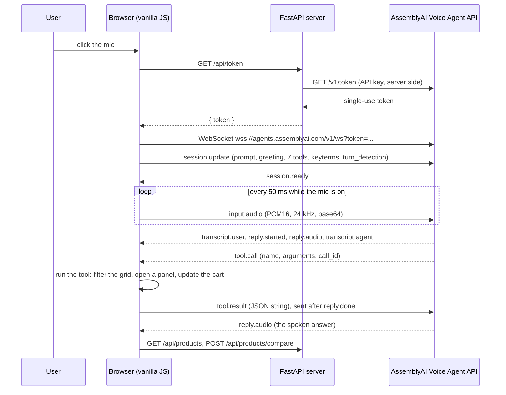

# VoiceCart AI architecture

The browser talks to AssemblyAI's Voice Agent API directly over a WebSocket. AssemblyAI runs speech-to-text, turn detection, the LLM and text-to-speech. Our FastAPI server does three things only: it mints a single-use token (`GET /api/token`), serves the product catalog, and serves the static site. The AssemblyAI API key never leaves the server.

## Files

| File | Role |
|---|---|
| `backend/main.py` | `GET /api/token`, `GET /api/products`, `GET /api/products/{id}`, `POST /api/products/compare`, static files |
| `backend/services/product_service.py` | Loads `data/products.json` (15 umbrellas) |
| `frontend/js/voice_agent.js` | WebSocket session, system prompt, event handling, barge-in, acknowledgements, memory |
| `frontend/js/agent_tools.js` | The 7 tool definitions and their handlers |
| `frontend/js/app.js` | Store state: filters, compare set, cart, checkout |
| `frontend/js/ui_renderer.js` | Renders the grid, panels, agent log and "Try saying" guide |
| `frontend/js/mic_worklet.js` | Mic capture: resample to 24 kHz, PCM16, local speech detector |
| `frontend/js/playback_worklet.js` | Agent audio: one continuous playback queue |

## Session setup

On socket open the page sends one `session.update`:

- `system_prompt`: voice rules (no markdown, answers as long as the question needs, round prices), grounding (only state what a tool returned), and how to use each tool.
- `greeting`: a first-visit greeting, or "Welcome back" when the visit already has history.
- `tools`: the 7 client-side tools below, built from the loaded catalog so brand and product id enums match it.
- `input.keyterms`: "VoiceCart" and every brand name, so speech recognition spells "TUMELLA" or "SIEPASA" the way the catalog does.
- `input.turn_detection`: `vad_threshold 0.5`, `min_silence 1000`, `max_silence 2000`, `interrupt_response true`. Measured with `scripts/voice_latency.py`: lowering `max_silence` from 4000 to 2000 cut time to first audio by about 2.5 s, and lower values made reply audio arrive with long gaps.

## Client-side tools

Tools run in the browser because each one changes the page. Handlers return compact JSON, and errors are specific sentences the model reads back, such as "the latest search has 4 results, so number 6 is out of range".

| Tool | UI effect | Returns |
|---|---|---|
| `search_products` | Sets the filters, re-renders the grid, numbers the top 3 cards | Match count, filters applied, top 5 results |
| `show_product` | Opens the detail drawer, outlines the card | Specs, pros, cons, review summary, a few reviews |
| `compare_products` | Opens the comparison table for 2 or 3 products | Each product by column |
| `update_compare` | Removes, adds or clears products in the open comparison | The updated columns |
| `update_cart` | Adds, removes or sets a quantity; animates the cart badge | Cart items and total |
| `checkout` | Opens the checkout summary, adding a named product first | Items and total; the agent must read the total and ask to confirm |
| `place_order` | Places the order and shows the confirmation | Order number; refused unless `user_confirmed` is true and checkout is open |

Positions: "the second one" is resolved in the browser against the latest search as numbered on screen, not left to the model's memory of older results.

Search handles spoken wording: filler words ("something for my") are dropped, spec words become filters ("windproof" means at least 50 mph, "light" at most 14 oz, "auto open" means automatic open), a color word becomes the color filter, and a word no umbrella has is left out and reported as `ignored_words` so the agent can say the store has nothing like it.

## Tool-result queue

The API accepts `tool.result` only when the current turn is over. The page tracks the turn: `reply.started` and `input.speech.started` mark it active, and `reply.done` ends it. Results that finish during a turn wait in a queue and are sent on `reply.done`. If that reply ended with `status: "interrupted"`, the queue is emptied and a generation counter marks results of still-running tools as stale, so the agent never answers a question the user has moved past.

## Interruption: pause, echo check, then let the server decide

Agent audio plays in its own 24 kHz `AudioContext`. The mic runs in a second context.

1. **Pause.** The mic worklet's energy detector posts `speech` after 60 ms above the threshold. The page suspends the playback context, so the agent stops mid-word, but nothing is discarded. The server's `input.speech.started` pauses it the same way.
2. **Echo check (600 ms).** Echo exists only while the agent is audible. If the mic goes quiet while playback is paused, the sound was the agent's own voice: playback resumes where it stopped, and the local detector threshold rises by 30% (up to 0.12) for the rest of the session.
3. **Server decision.** If the user keeps talking, playback stays paused. A `reply.done` with `status: "interrupted"`, or a new `reply.started`, discards the held audio. If the server does not interrupt within 0.8 s after the user stops, playback resumes. If the server also never transcribed the user, the dock asks them to repeat.

## Playback worklet

Reply audio arrives in ~10 ms chunks, in bursts and sometimes slower than real time. `playback_worklet.js` plays it as one continuous queue:

- A segment starts once 300 ms is buffered, then chunks play back to back.
- On an underrun it fades out over ~5 ms, waits for 500 ms of audio and fades back in. Each underrun adds 200 ms to both waits, up to 1 s.
- Each reply and each acknowledgement clip is its own segment. `clear` drops everything.
- It posts `progress` every ~50 ms, which times the card highlights to the words being spoken.

`scripts/replay_playback.js` replays captured replies through the worklet offline to compare versions.

## Acknowledgement clips

A search takes a model decision, the tool and a second model turn, which leaves seconds of silence. On `tool.call` for `search_products` the page plays one of three short clips ("Sure, let me look.") from `frontend/audio/`, at most once per user turn and only when the agent is silent. `scripts/record_fillers.py` records the clips from the Voice Agent API itself, so they use the live agent's voice. They go through the same playback queue, so barge-in pauses and discards them like any other agent audio.

## Memory across sessions in a visit

The page keeps the last 40 transcript lines for the whole visit (lost on reload). When the user stops the mic and starts it again, the new session gets a "Welcome back" greeting and, after `session.ready`, a `conversation.message` with role `system` containing the earlier conversation, the latest search results by position, the open view (detail, comparison, cart or checkout) and the cart. The agent continues from there.

## Session end

Stopping the mic sends `session.end` before closing, so the session is not billed for the 30 s resume window. The page also sends it on `pagehide`.
