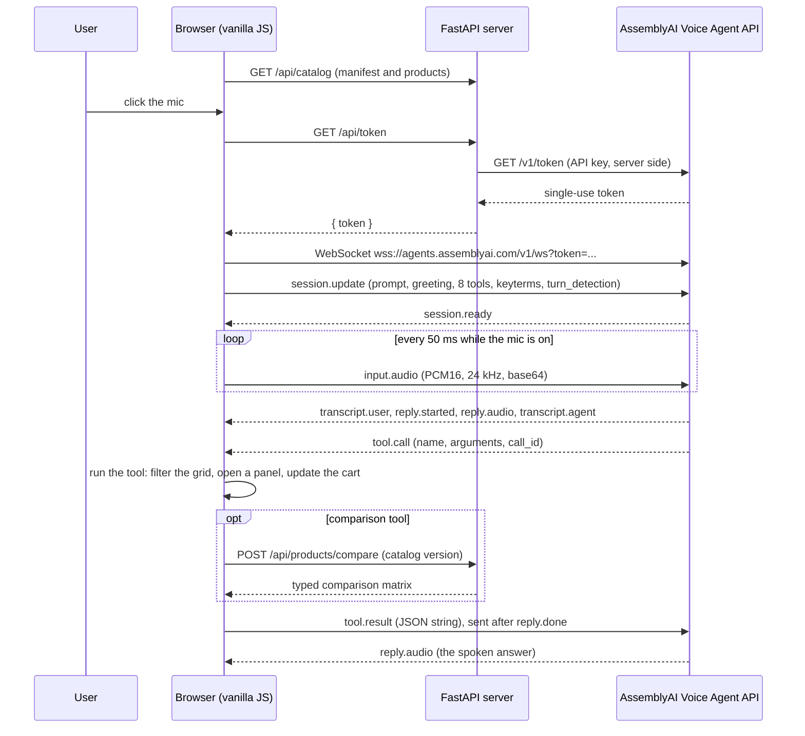

# VoiceCart AI architecture

The browser talks to AssemblyAI's Voice Agent API directly over a WebSocket. AssemblyAI runs speech-to-text, turn detection, the LLM and text-to-speech. Our FastAPI server mints a single-use token (`GET /api/token`), serves the active versioned catalog and comparison matrix, accepts password-protected manual listings, and serves the static site. The AssemblyAI API key never leaves the server.

```mermaid
sequenceDiagram
    participant U as User
    participant B as Browser (vanilla JS)
    participant S as FastAPI server
    participant A as AssemblyAI Voice Agent API

    B->>S: GET /api/catalog (manifest and products)
    U->>B: click the mic
    B->>S: GET /api/token
    S->>A: GET /v1/token (API key, server side)
    A-->>S: single-use token
    S-->>B: { token }
    B->>A: WebSocket wss://agents.assemblyai.com/v1/ws?token=...
    B->>A: session.update (prompt, greeting, 8 tools, keyterms, turn_detection)
    A-->>B: session.ready
    loop every 50 ms while the mic is on
        B->>A: input.audio (PCM16, 24 kHz, base64)
    end
    A-->>B: transcript.user, reply.started, reply.audio, transcript.agent
    A-->>B: tool.call (name, arguments, call_id)
    B->>B: run the tool: filter the grid, open a panel, update the cart
    opt comparison tool
        B->>S: POST /api/products/compare (catalog version)
        S-->>B: typed comparison matrix
    end
    B->>A: tool.result (JSON string), sent after reply.done
    A-->>B: reply.audio (the spoken answer)
```

## Files

| File | Role |
|---|---|
| `backend/main.py` | Token, active catalog, product, comparison, manual admin endpoints, static files |
| `backend/services/catalog.py` | Validates normalized products/manifests and publishes immutable catalog bundles |
| `backend/services/catalog_onboarding.py` | One-time onboarding: LLM Gateway proposal, review report, approval, or a hand-written manifest |
| `backend/services/product_service.py` | Loads the selected bundle, adds listings, and builds the shared comparison matrix |
| `frontend/js/catalog_runtime.js` | Shared category search/filter helpers and formatting |
| `frontend/js/voice_agent.js` | WebSocket session, system prompt, event handling, barge-in, acknowledgements, memory |
| `frontend/js/agent_tools.js` | The 8 tool definitions and their handlers |
| `frontend/js/app.js` | Store state: filters, compare set, cart, checkout |
| `frontend/js/ui_renderer.js` | Renders the grid, panels, agent log and "Try saying" guide |
| `frontend/js/mic_worklet.js` | Mic capture: resample to 24 kHz, PCM16, local speech detector |
| `frontend/js/playback_worklet.js` | Agent audio: one continuous playback queue |

## Catalog onboarding and versioning

`data/products.json` remains the umbrella source fixture. The active, normalized deployment bundles live under `data/catalogs/<category>/<version>/`. Each has a `manifest.json` and `products.json`; `active.json` selects the version for that category. `ACTIVE_CATALOG` selects one category per storefront deployment (default `umbrella`). The browser loads manifest and products together from `GET /api/catalog` before opening the voice WebSocket. Its comparison requests include the loaded version, so a catalog update cannot change the screen's comparison data partway through the visit.

Onboarding runs separately from customer requests: `python -m backend.services.catalog_onboarding <source.json> --category <slug>`. The default provider is the AssemblyAI LLM Gateway (`POST https://llm-gateway.assemblyai.com/v1/chat/completions`, authenticated with `ASSEMBLYAI_API_KEY`; `CATALOG_LLM_MODEL` names the model, default `qwen3.5-4b-32k-fast`). `--provider command` uses a local adapter from `CATALOG_LLM_COMMAND`. The model sees a field inventory and up to four sample records and proposes structured mappings and category rules. The gateway's structured output mode takes a strict JSON Schema, which cannot describe the manifest's free-key maps, so the request asks for JSON only and relies on validation. Pydantic validation and deterministic normalization then check the proposal. The result is written to `data/proposals/<proposal-id>/` with a review report in `docs/onboarding/<category>-review.md`, and nothing is published until `--approve <proposal-id>`. Approval is refused if validation failed or the proposal changed after it was written. `--manifest-template` publishes a hand-written manifest directly; `data/umbrella_manifest.template.json` reproduces the umbrella bundle without an API call. A 3-product dry-fruit catalog in `tests/fixtures/` is the second-category test data. See [INTEGRATION.md](INTEGRATION.md).

Each product has stable identity, price/currency, description, image, typed attributes, and optional reviews and variants. Attribute rules define units, filter operators, display labels, comparison order/direction/confidence, and a rationale. Unit conversion occurs during normalization. A comparison row with confidence below `COMPARISON_CONFIDENCE_CUTOFF` remains visible without a highlighted winner. The backend builds one typed matrix used by both the screen and `compare_products`.

The admin form uses the active manifest to accept new category attributes. Every save publishes a new bundle; the editor has no voice tool. Checkout remains an in-browser simulation with fixed 8% tax and no payment or fulfillment integration.

## Session setup

On socket open the page sends one `session.update`:

- `system_prompt`: one fixed category-neutral instruction for the eight tool workflows and grounding. Product facts appear only in tool definitions/results.
- `greeting`: a first-visit greeting, or "Welcome back" when the visit already has history.
- `tools`: the same 8 client-side operations below, with category attributes and valid filters generated from the loaded manifest.
- `input.keyterms`: store/category and brand names from the active catalog.
- `input.turn_detection`: `vad_threshold 0.5`, `min_silence 1000`, `max_silence 2000`, `interrupt_response true`. Measured with `scripts/voice_latency.py`: lowering `max_silence` from 4000 to 2000 cut time to first audio by about 2.5 s, and lower values made reply audio arrive with long gaps.

## Client-side tools

Tools run in the browser because each one changes the page. Handlers return compact JSON, and errors are specific sentences the model reads back, such as "the latest search has 4 results, so number 6 is out of range".

| Tool | UI effect | Returns |
|---|---|---|
| `search_products` | Sets the filters, re-renders the grid, numbers the top 3 cards | Match count, filters applied, top 5 results |
| `show_product` | Opens the detail drawer, outlines the card | Specs, pros, cons, review summary, a few reviews |
| `compare_products` | Opens the comparison table for 2 or 3 products | Each product by column |
| `update_compare` | Removes, adds or clears products in the open comparison | The updated columns |
| `update_cart` | Adds, removes or sets a quantity; animates the cart badge | Cart items and total |
| `show_cart` | Opens the cart drawer | Cart items and total |
| `checkout` | Opens the checkout summary, adding a named product first | Items and total; the agent must read the total and ask to confirm |
| `place_order` | Places the order and shows the confirmation | Order number; refused unless `user_confirmed` is true and checkout is open |

Positions: "the second one" is resolved in the browser against the latest search as numbered on screen, not left to the model's memory of older results.

Search handles spoken wording with generic filler removal and manifest search aliases. A category can map a phrase to a typed filter. The umbrella manifest preserves its wind/weight/color aliases; the dry-fruit manifest exposes origin, pack weight, protein, and roasting. Unknown words are reported as `ignored_words` so the agent can explain the limitation.

## Tool-result queue

The API accepts `tool.result` only when the current turn is over. The page tracks the turn: `reply.started` and `input.speech.started` mark it active, and `reply.done` ends it. Results that finish during a turn wait in a queue and are sent on `reply.done`. If that reply ended with `status: "interrupted"`, the queue is emptied and a generation counter marks results of still-running tools as stale, so the agent never answers a question the user has moved past.

## Interruption: pause, echo check, then let the server decide

Agent audio plays in its own 24 kHz `AudioContext`. The mic runs in a second context.

1. **Pause.** The mic worklet's energy detector posts `speech` after 60 ms above the threshold. The page suspends the playback context, so the agent stops mid-word, but nothing is discarded. The server's `input.speech.started` pauses it the same way.
2. **Echo check (600 ms).** Echo exists only while the agent is audible. If the mic goes quiet while playback is paused, the sound was the agent's own voice: playback resumes where it stopped, and the local detector threshold rises by 30% (up to 0.12) for the rest of the session.
3. **Server decision.** If the user keeps talking, playback stays paused. A `reply.done` with `status: "interrupted"`, or a new `reply.started`, discards the held audio. If the server does not interrupt within 0.8 s after the user stops, playback resumes. If the server also never transcribed the user, the dock asks them to repeat.

## Playback worklet

Reply audio arrives in ~10 ms chunks, in bursts and sometimes slower than real time. `playback_worklet.js` plays it as one continuous queue:

- A segment starts once 300 ms is buffered, then chunks play back to back.
- On an underrun it fades out over ~5 ms, waits for 500 ms of audio and fades back in. Each underrun adds 200 ms to both waits, up to 1 s.
- Each reply and each acknowledgement clip is its own segment. `clear` drops everything.
- It posts `progress` every ~50 ms, which times the card highlights to the words being spoken.

`scripts/replay_playback.js` replays captured replies through the worklet offline to compare versions.

## Acknowledgement clips

A search takes a model decision, the tool and a second model turn, which leaves seconds of silence. When the server ends the user's turn (`transcript.user`), `AgentTools.ackFor` picks a clip from the user's words. A search gets "Sure, let me look.". Compare, cart, checkout and review requests get "Okay, one moment.". Chit-chat and the order confirmation get none. If no clip played and the model calls a tool, one plays on `tool.call` instead. Clips live in `frontend/audio/`, play at most once per user turn and only when the agent is silent. `scripts/record_fillers.py` records the clips from the Voice Agent API itself, so they use the live agent's voice. They go through the same playback queue, so barge-in pauses and discards them like any other agent audio.

## Memory across sessions in a visit

The page keeps the last 40 transcript lines for the whole visit (lost on reload). When the user stops the mic and starts it again, the new session gets a "Welcome back" greeting and, after `session.ready`, a `conversation.message` with role `system` containing the earlier conversation, the latest search results by position, the open view (detail, comparison, cart or checkout) and the cart. The agent continues from there.

## Session end

Stopping the mic sends `session.end` before closing, so the session is not billed for the 30 s resume window. The page also sends it on `pagehide`.
